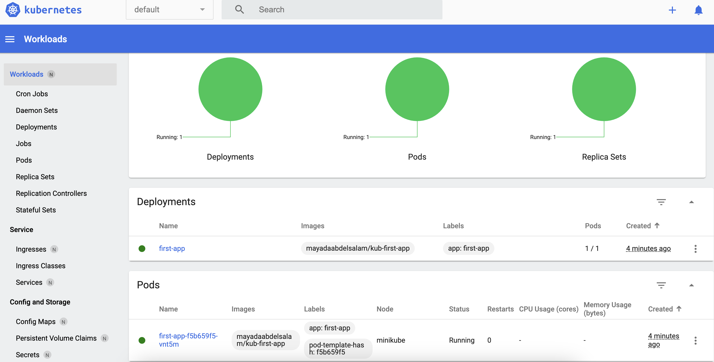
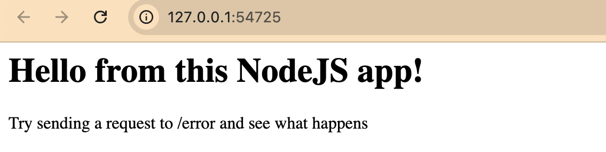
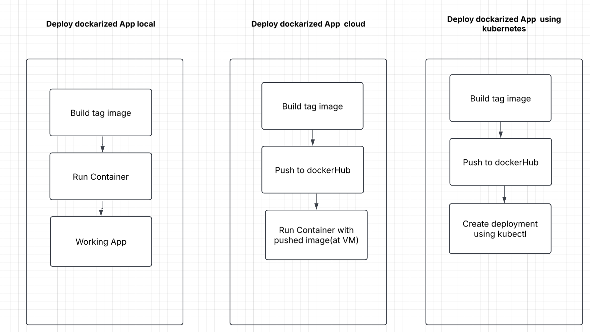

# KubernetesLearning
- **Project Overview**
- **Project Structure**
- **Deploy Docker App using Kubernetes**

📌 **Project Overview** simple web application node.js has two endpoints:

 Get request to nothing , Get request to error

 Our target to deploy the project to kubernetes cluster 

📂 **Project Structure**

│── KubernetesLearning/

  ├── kub-action-01-starting-setup 
  ├── dockerfile                        # Docker configuration
  ├── dockerignore                     # Files to be ignored
  ├── package.json                      # Dependencies
  ├── app.js                            # Application source code  
  ├── images                            # Readme images 
 ├── README.md                          # Project details`

🎯 **Deploy Docker App using Kubernetes**

 *Pre requisite:*

Download kubctl (is the **command-line tool** used to interact with **Kubernetes clusters)**

`brew install kubectl`

install minikube (**Lightweight Kubernetes cluster** that runs locally on your machine)

`brew install minikube`

Start a cluster using the driver by checking the compatible driver based on your machine type 
https://minikube.sigs.k8s.io/docs/drivers/

`minikube start --driver=docker`

install minikube dashboard to bring visual view for clusters

`minikube dashboard` 

*Deployment Steps:*

Build docker image 

`docker build -t image_Name .`

Create repo at dockerHub with name “`Hub_image_Name` ” ,then push the image 

`docker tag image_Name Hub_image_Name` 

`docker push Hub_image_Name` 

Then we send the build image to kubernetes cluster as part of deployment which offer container running in the pod 

`kubectl create deployment DeploymentName  -—image=Hub_image_Name`

to check deployments status

`kubectl get deployment`

to get pods status 

`kubectl get pods`

to check dashboard 

 `minikube dashboard`

Assign specific port to the cluster so we can access the app

 `kubectl expose deployment first-app --type=LoadBalancer --port=8080`

To view your node.js application running in the container 

 `minikube service first-app`

Scale the Pod/container 

`kubectl scale deployment/first-app --replicas=3`

Summery for docker and kubernetes deployment steps

🌟 **Contributing**

This is a personal learning project, but feel free to open an issue or suggest improvements.

